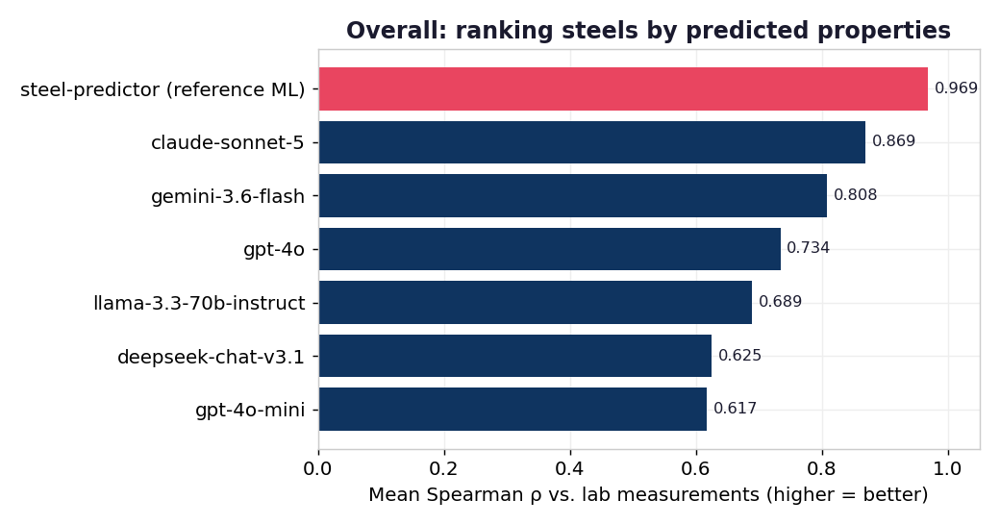
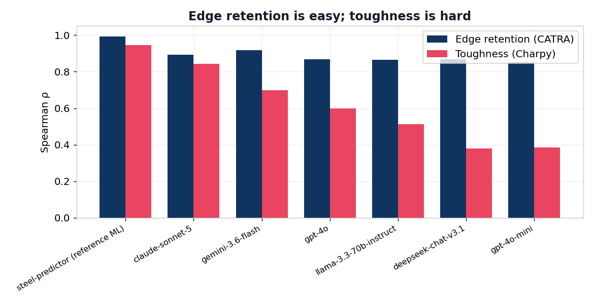
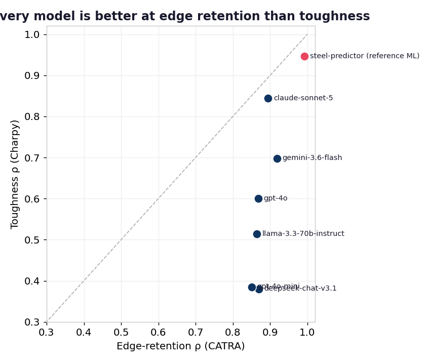
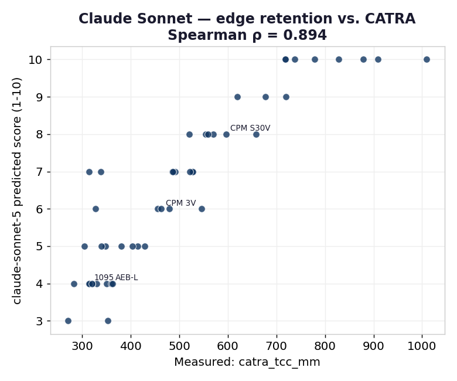
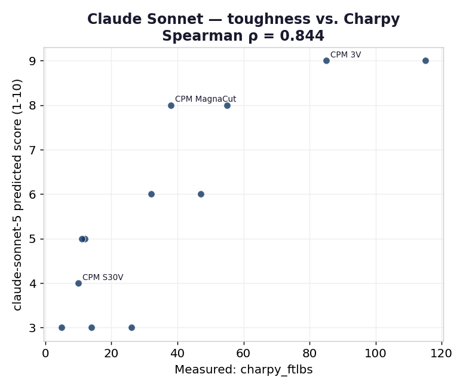

# Results & Analysis

Full numbers in [`results/scores.csv`](../results/scores.csv); per-steel model outputs in [`results/raw_*.csv`](../results/). Figures are in [`docs/assets/`](assets/).

## Overall leaderboard

| Model | Edge ρ (n) | Edge pairwise | Tough ρ (n) | Tough pairwise | **Mean ρ** |
|---|---|---|---|---|---|
| steel-predictor (reference ML) † | 0.992 (48) | 0.98 | 0.946 (12) | 0.938 | **0.969** |
| anthropic/claude-sonnet-5 | 0.894 (48) | 0.918 | 0.844 (12) | 0.881 | **0.869** |
| google/gemini-3.6-flash | 0.918 (48) | 0.913 | 0.698 (12) | 0.797 | **0.808** |
| openai/gpt-4o | 0.868 (48) | 0.907 | 0.600 (12) | 0.746 | **0.734** |
| meta-llama/llama-3.3-70b-instruct | 0.864 (47) | 0.964 | 0.514 (12) | 0.780 | **0.689** |
| deepseek/deepseek-chat-v3.1 | 0.869 (48) | 0.910 | 0.380 (12) | 0.661 | **0.625** |
| openai/gpt-4o-mini | 0.850 (48) | 0.984 | 0.385 (12) | 0.617 | **0.617** |

_† trained on this data — in-sample upper bar, not a fair comparison. See [methodology](methodology.md#5-baselines)._

## Finding 1 — Edge retention is "easy"; toughness is "hard"

Every model predicts **edge retention** far better than **toughness**. The best LLM (Claude Sonnet) hits ρ = 0.89 on edge retention — approaching the trained model — but even the strongest models sag on toughness, and the weakest fall to ρ ≈ 0.38.

Why this makes metallurgical sense:
- **Edge retention is close to a function of composition.** Wear resistance is dominated by hard carbide volume, which is set by carbide-forming elements (C, V, Cr, W, Mo). That relationship is legible, monotonic, and heavily documented — exactly what an LLM can internalize.
- **Toughness is a competition, not a sum.** It depends on carbide *size and distribution*, powder-metallurgy processing, retained austenite, and the hardness the steel is run at — factors that a bare composition string underdetermines. High carbon and vanadium can *raise* wear resistance while *lowering* toughness, so naive "more alloy = better" reasoning breaks down.

Every point sits below the diagonal: models are universally better at ordering edge retention than toughness.

## Finding 2 — Frontier models clearly separate from smaller ones

On edge retention, the field is bunched (ρ 0.85–0.92) — even `gpt-4o-mini` orders steels well. The separation shows up on **toughness**, where `claude-sonnet-5` (0.844) and `gemini-3.6-flash` (0.698) pull well clear of `gpt-4o-mini` (0.385) and `deepseek-chat-v3.1` (0.380). Toughness is the discriminating task.

## Finding 3 — The best LLM tracks the measurements closely

For Claude Sonnet, predicted scores rise monotonically with the measured values on both properties. The toughness scatter also exposes the failure mode: several genuinely tough steels are compressed into the low scores, because the model hedges toward the middle when chemistry alone is ambiguous.

## What this does and doesn't show

- **It does** show that modern LLMs carry a real, quantifiable amount of materials knowledge — enough to rank wear resistance about as well as a purpose-built model, from composition alone.
- **It doesn't** show LLMs can replace a measured model or lab testing: toughness ordering is unreliable, magnitudes aren't calibrated, and none of this accounts for heat treatment or geometry.
- **The trained model's edge here is partly an artifact** of having seen the labels (see the fairness caveat). The honest comparison is on toughness generalization and on out-of-sample data — a good direction for future work.

## Next steps
- Add few-shot, chain-of-thought, and self-consistency prompt variants.
- Grow the measured toughness set (n = 12 is the weakest link).
- Add a held-out split so the trained baseline can be compared out-of-sample.
- Track results across model releases over time.
